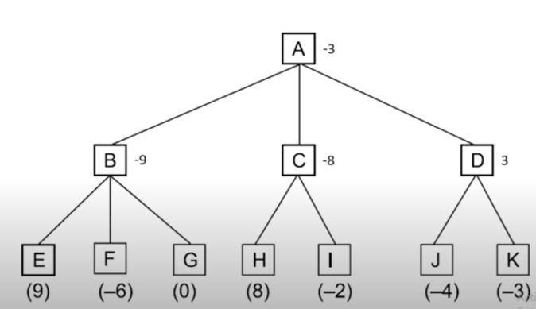

# Assignment 3. Programming of Intelligent Information Systems course

### Project Structure

 1. NegaMax
 2. NegaScout
 3. PVS

## 0. Evaluation Function

For all our algorithm implementations, we need evaluation function to estimate the value or goodness of a position (usually at a leaf or terminal node) in a game tree.

In our case, we depend on positions number of white/black pieces and material balance of the board.

```
    def material_balance(self, board, white, black):
        return (
                chess.popcount(white & board.pawns) - chess.popcount(black & board.pawns) +
                3 * (chess.popcount(white & board.knights) - chess.popcount(black & board.knights)) +
                3 * (chess.popcount(white & board.bishops) - chess.popcount(black & board.bishops)) +
                5 * (chess.popcount(white & board.rooks) - chess.popcount(black & board.rooks)) +
                9 * (chess.popcount(white & board.queens) - chess.popcount(black & board.queens))
        )
```


Read more about material balance in the chess [here](https://www.chess.com/article/view/the-evaluation-of-material-imbalances-by-im-larry-kaufman).
Now, let's declare some constants.

## 1. NegaMax Implementation

- it is a variant of MiniMax;
- the value of a given position to the first player is a negation of the value to the second player;
- each player looks for a move that will maximise the damage to the opponent;



## 2. NegaScout Implementation

- Idea: search first move fully to establish a lower bound v
- Null window search to try to prove that other moves have
score <= v
- If fail high, re-search to establish exact score of new, better
move
- With good move ordering, re-search rarely needed. Savings
from using null window outweigh cost of re-search 

## 3. Principal variation search

Very similar to NegaScout Algorithm.

## 4. Game Engine
Let's request which algorithm implementation we want to test.

In case of invalid input, there will be exception raised.

After that, we implement game simulation with the user.